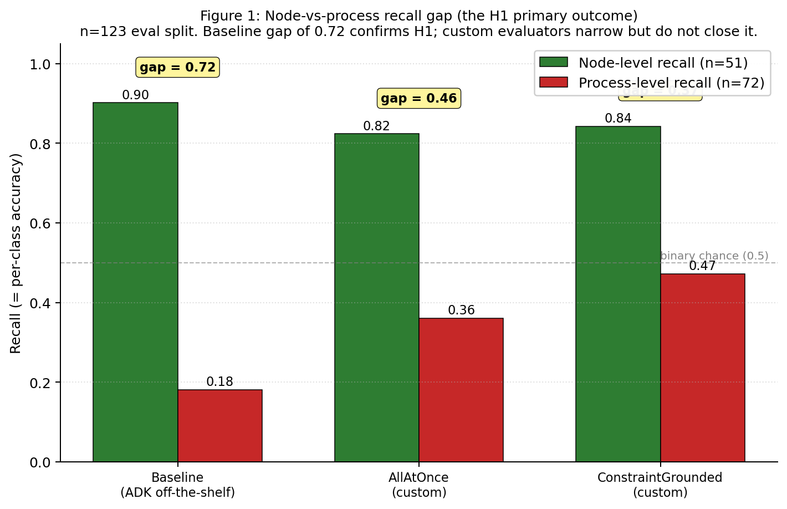
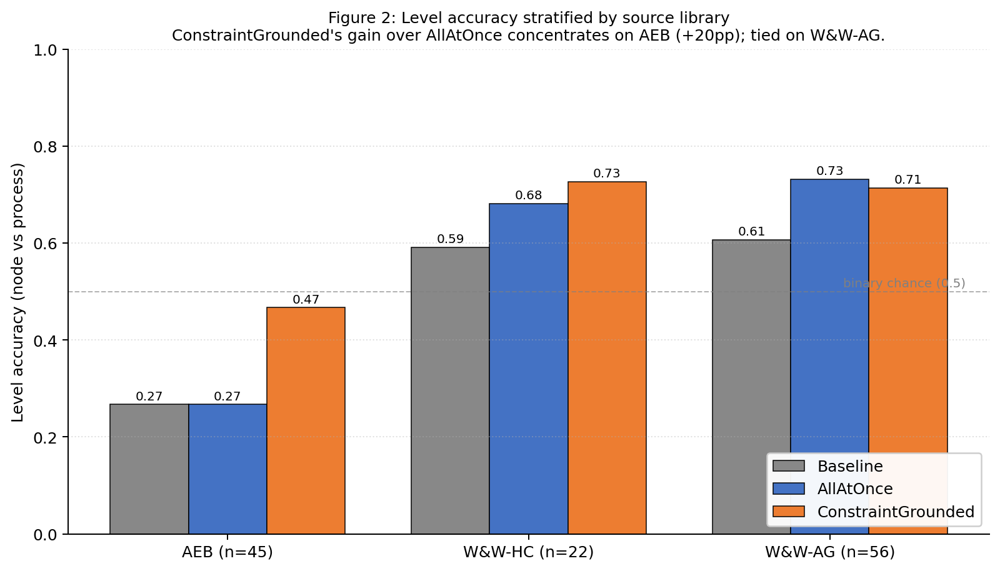
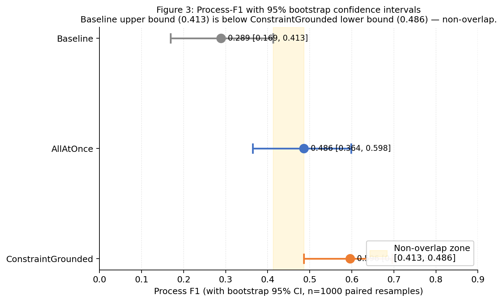
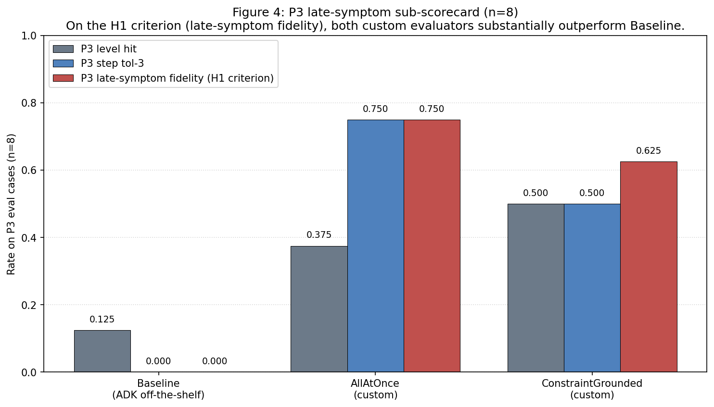

# Evaluating Failure Attribution on Multi-Agent GAIA Trajectories with the Google ADK Evaluation Suite

_Working draft · last updated 2026-04-19 · target: school academic report_

**Author:** Mel Wong (CMU)

---

## Abstract

Multi-agent systems built on large language models fail in ways that are hard to attribute: trajectories run for tens of steps, errors introduced early can surface much later, and a single wrong final answer can arise from very different upstream causes. **Failure attribution** is the task of, given a failed trajectory, identifying the earliest step at which the failure was introduced and labelling it with a failure category. This paper asks whether Google's Agent Development Kit (ADK) evaluation suite — an off-the-shelf library for evaluating agent systems — can perform this harder task on the GAIA benchmark.

We test a single hypothesis: **ADK's off-the-shelf rubric-based evaluator will detect node-level failures at substantially higher rates than process-level failures on GAIA — a structural mismatch between where failures occur in the agent pipeline and what this specific evaluator is designed to assess**. H1 is operationalized as a minimum 40-percentage-point gap in per-level recall on the Baseline, significance-tested via paired McNemar against the strongest custom configuration. To test it, we consolidate two existing annotated GAIA libraries (AgentErrorBench and Who&When) into a 133-record failure-attribution benchmark with a 9-cluster taxonomy derived from a 70-type literature synthesis. We evaluate three ADK configurations: the off-the-shelf rubric-based evaluator (Baseline), a custom one-pass trajectory evaluator (AllAtOnce), and a custom two-step evaluator that grounds judgement in a per-trajectory log of symptom-level constraint violations (ConstraintGrounded). We score each on node-vs-process level accuracy, origin-step localization, and cluster match.

The Baseline confirms H1 sharply: it recalls 90.2% of node-level failures but only 18.1% of process-level failures (paired McNemar p = 0.002 against ConstraintGrounded). Custom evaluators narrow the gap: AllAtOnce reaches 36.1% process recall, and ConstraintGrounded — grounded in symptom-layer evidence — reaches 47.2% (a 29-percentage-point improvement over Baseline). Step localization at tolerance-3 is solved to ≈65% by both custom evaluators and is untestable on the Baseline. Calibration against human labels on a five-case set was below the pre-specified κ ≥ 0.70 threshold for all three methods, limiting the strength of paired-case claims; larger calibration is listed as the highest-leverage future work. H1 is confirmed, and the structural gap does not close under any evaluator tested — only narrows.

---

## 1. Introduction

### 1.1 Motivation

Agent systems — large language models augmented with tools, planning, and memory — are increasingly deployed on long-horizon tasks. GAIA (Mialon et al., 2023) has become a canonical benchmark for these systems: questions that require multi-hop research, tool use, and verification. Current leading multi-agent architectures succeed on roughly half of GAIA, which means about half of all runs fail, producing a large population of failed trajectories that is valuable to study.

Knowing that a trajectory failed is different from knowing *why* it failed. A wrong final answer can arise from a hallucination at the last step, a wrong tool selected at step two, a plan that was never going to succeed, or an earlier error that silently contaminated every subsequent step. Each of these has a different corrective intervention — prompt edit, tool fix, orchestration change, memory architecture — and an evaluation method that cannot distinguish them is of limited use to the operator.

This paper focuses on a specific technical task: **failure attribution on a trajectory**, as formalized by Zhang et al. (2025) in the Who&When benchmark. Given a trajectory that ended in an incorrect answer, identify the earliest step at which the failure was introduced (the **origin step**) and the failure category (the **cluster**). Trajectory-level attribution of a single origin is the scope; per-step classification of every step is out of scope.

### 1.2 Why this is hard

Failures split naturally into two regimes. **Node-level failures** are localized to a single step: a fact fabricated at step four, a tool called with a malformed argument at step seven, an error message ignored. They are, in principle, visible at the step where they occur. **Process-level failures** are structural or cumulative: an early misreading of the task, a plan that was structurally wrong from the start, a progression of steps each of which looks locally reasonable but that together cannot reach the correct answer. Prior empirical taxonomies have documented both regimes: MAST (Cemri et al., 2025) catalogues specification failures (41.8% of 1,242 traces) alongside step-level errors, and AgentFail (Ma et al., 2026) reports that 32% of platform-orchestrated failures involve cross-node propagation, with the root cause at a different node than where the failure becomes observable.

For process-level failures, the step where the failure was *introduced* and the step where it *becomes visible* can be many turns apart (Ma et al., 2026; Barke et al., 2026). A naive evaluator reading the trajectory and pointing at the step where the answer most obviously goes wrong will systematically attribute process-level failures to their late symptoms. We call this the **late-symptom bias** and treat it as a first-class evaluation criterion: any attribution method worth the name must resist it.

### 1.3 Research question

We evaluate whether Google's ADK evaluation suite can perform failure attribution on GAIA, with a specific hypothesis:

> **H1.** ADK's off-the-shelf rubric-based evaluator (`rubric_based_final_response_quality_v1`) will detect node-level failures at substantially higher rates than process-level failures on GAIA, reflecting a structural mismatch between where failures occur in the agent pipeline and what this specific evaluator is designed to assess.

H1 is scoped to a single evaluator — the off-the-shelf ADK rubric-based judge — and to a single task substrate (GAIA). The broader conjecture that similar asymmetry affects output-only LLM-as-judge evaluators generally is discussed in Section 7.1 but is not tested here. If the off-the-shelf evaluator confirms H1 and custom evaluators within the same suite narrow the gap, the paper has two things to say about ADK specifically: that the default configuration of this evaluator is systematically blind to process-level failures on GAIA, and that specific extensions within the same suite can reduce — though, in our results, not close — the gap. Whether this pattern generalizes across evaluation suites is a broader question we return to in the Discussion.

### 1.4 Contributions

1. **A consolidated, GAIA-only, failure-attribution benchmark of 133 labelled trajectories** built by unifying AgentErrorBench (50 records) and Who&When (83 records after filtering and dedup) with a row-by-row cluster-review pass.
2. **A two-level, nine-cluster failure taxonomy** — five node-level clusters (N1–N5) and four process-level clusters (P1–P4) — reduced from a 70-type literature synthesis to the subset most frequent in GAIA.
3. **A three-axis scoring protocol** that separates origin-step match, cluster/level match, and late-symptom fidelity.
4. **An evaluation of three ADK configurations** against the scoring protocol: an off-the-shelf rubric baseline, a one-pass custom evaluator (AllAtOnce), and a symptom-grounded two-step custom evaluator (ConstraintGrounded, adapted from AgentRx's evidence-grounded judging methodology; Barke et al., 2026) with the constraint catalogue drawn from MAST's task-specification taxonomy (Cemri et al., 2025).
5. **Empirical confirmation of H1**, with McNemar's (1947) paired χ² test and bootstrap confidence intervals (Efron, 1979); quantification of the gap and the degree to which each custom configuration narrows it.

### 1.5 Scope and non-goals

We do not train or modify the agent systems under test. We do not attempt per-step classification of every step in every trajectory. We do not claim the nine clusters constitute a universal taxonomy of agentic failure — they are the clusters the GAIA-observable data supports. We do not evaluate every ADK evaluator; of the five shipped, only the rubric-based one is directly adaptable to attribution, and the other four are either retrieval-style matchers unsuitable for the task or orthogonal to failure attribution.

---

## 2. Background and Related Work

### 2.1 GAIA benchmark

GAIA (Mialon et al., 2023) is a benchmark of 466 real-world questions requiring multi-hop research and tool use. It is the canonical task substrate for the failure libraries used in this paper. Current leading multi-agent systems succeed on roughly 50% of GAIA; the remaining failures are what we annotate and evaluate over.

### 2.2 Annotated failure libraries

Two libraries provide ground-truth failure annotations for agent trajectories on GAIA:

- **AgentErrorBench** (Zhu et al., 2025; arXiv:2509.25370) provides 200 labelled trajectories across three single-agent models (GPT-4o, Llama3.3-70B-Turbo, Qwen3-8B) with a module-and-type taxonomy: each failure is tagged with `critical_failure_module` ∈ {planning, action, memory, reflection, system} and a module-specific `failure_type`. Fifty of the 200 are GAIA; the remaining 150 cover WebShop and ALFWorld and are excluded from this paper.
- **Who&When** (Zhang et al., 2025; arXiv:2505.00212) provides two splits: Hand-Crafted (58 trajectories, multi-agent Magentic-One architecture) and Algorithm-Generated (126 trajectories, CaptainAgent dynamic expert architecture). Both splits attach a `mistake_step`, `mistake_agent`, and a free-text `mistake_reason` to each failure but do not standardize the failure-type vocabulary — this is the primary consolidation task Section 4 addresses.

Two further libraries were considered for this paper but not used as direct inputs: **MAST** (Cemri et al., 2025; arXiv:2503.13657) annotates 1,242 multi-agent traces with a 14-mode taxonomy but provides trace-level labels only (no per-agent attribution); and **AgentRx** (Barke et al., 2026; arXiv:2602.02475) annotates 115 trajectories from τ-bench and Magentic-One customer-service workflows. MAST's lack of per-agent attribution and AgentRx's non-GAIA domain make them unsuitable as direct dataset inputs, but both are primary influences on our taxonomy (Section 4.3) and methodology (Section 5.4).

### 2.3 Prior failure taxonomies

The nine-cluster taxonomy used in this paper was not designed from scratch. It is the result of a literature synthesis that catalogued 70 canonical agent-failure types from seven taxonomy-focused research papers and one security standard, supplemented by 13 domain case studies covering IT/cloud, clinical, coding, cybersecurity, legal, contact-center, and research-agent settings. The primary sources are listed in the References section (Taxonomy papers group) and the full 70-type catalogue is recorded in Appendix A.

Key empirical observations from the literature that shaped our analysis:

- MAST (Cemri et al., 2025) reports step repetition as the single most frequent failure mode at 17.14% of 1,242 annotated traces; reasoning-action mismatch at 13.98%; specification issues overall at 41.8%.
- AgentRx (Barke et al., 2026) reports misinterpretation of tool output as the most frequent root cause (22 of 31 occurrences) among 115 trajectories.
- AgentErrorBench (Zhu et al., 2025) reports planning failures as the dominant category (78 of its step-level annotations), with most failures clustering in mid-trajectory steps 6–15.
- Ma et al. AgentFail (2026; arXiv:2509.23735) reports that 32% of failures in platform-orchestrated workflows involve cross-node propagation — the root cause is at a different node than where the failure becomes observable. For logic and control nodes, 45% of failures are non-local.
- Shah et al. (2026; arXiv:2603.06847) reports that dependency and integration changes are the most common root cause (19.5%) in 385 faults across 40 open-source agentic repositories.

No single prior taxonomy perfectly fits GAIA, and each was designed for a different analytical purpose. Our reduction to nine GAIA-observed clusters is described in Section 4.3.

### 2.4 LLM-as-judge methodology

The three evaluator configurations in this paper all use an LLM as the judge. The design of LLM-as-judge protocols has a substantial methodology literature — G-Eval (Liu et al., 2023) reports a Spearman ρ lift from 0.51 to 0.66 on summarization tasks when chain-of-thought reasoning is emitted before the verdict; MT-Bench (Zheng et al., 2023) catalogues position, verbosity, and self-preference biases. Our prompt design applies five standard mitigations: chain-of-thought before verdict, structured output schema, per-prediction confidence, explicit bias neutralisation (position bias is absent because scoring is absolute; verbosity bias is neutralised by structured schema; self-preference is addressed via a flash-lite ablation), and long-context lazy-parsing mitigation via strict JSON mode with a validation-plus-retry loop.

### 2.5 Google ADK evaluation suite

The Google Agent Development Kit evaluation suite (Google, 2025) is a scaffold rather than a single metric. It ships an `EvalSet`/`EvalCase` data format, an `Evaluator` base class, six callback hooks (`before/after_agent`, `before/after_model`, `before/after_tool`) for inserting logic into agent execution, and five pre-built evaluators:

- `rubric_based_final_response_quality_v1` — reference-free LLM-as-judge over a list of yes/no rubrics.
- `final_response_match_v2` — LLM-as-judge for exact-match style final-response equivalence.
- `tool_trajectory_avg_score` — matches an observed tool-call sequence against an expected one.
- `response_match_score` — ROUGE-1 lexical match.
- `safety_v1` — safety-policy classifier.

Only the first is directly usable for attribution. `final_response_match_v2` is usable as a gate to confirm the trajectory failed. `tool_trajectory_avg_score` requires a pre-specified expected trajectory, which we do not have. `response_match_score` is lexical and inadequate for GAIA's semantic matching. `safety_v1` is unrelated. Per-step error localization, cascading-error detection, goal-drift detection, late-symptom penalties, and a failure-taxonomy annotation schema on `EvalCase` are not present and must be added by the user — via custom `Evaluator` subclasses and the callback hooks. Section 5 specifies how we add them.

---

## 3. Research Question and Scoring Protocol

### 3.1 Formal definition of the failure-attribution task

Let a trajectory τ be a sequence of steps s₁, s₂, …, s_T, where each step records an agent's action, tool call, observation, and reasoning. Assume τ is a failure trajectory (the final answer is incorrect).

The failure-attribution task is a mapping

f: τ ↦ (s*, c*)

where s* ∈ {1, …, T} is the predicted origin step and c* ∈ 𝒞 is the predicted failure cluster, with 𝒞 the nine-cluster vocabulary defined in Section 4.

Ground truth for each trajectory is a pair (s_gt, c_gt) derived from the annotation in the source library. This formulation follows Who&When (Zhang et al., 2025), which formalizes the attribution task as identifying a `mistake_step` and a failing agent per trajectory; the cluster axis c* is our addition, aligning the per-trajectory prediction with a controlled vocabulary (Section 4.3) rather than a free-text reason string.

### 3.2 Three scoring axes

A predicted (s*, c*) is scored against ground truth along three axes:

1. **Origin-step match.** We report two tolerance levels. Tolerance-0 requires s* = s_gt (exact match). Tolerance-3 requires |s* − s_gt| ≤ 3; this is the primary metric. Who&When's own reported numbers (Zhang et al., 2025) show exact step matching is extremely noisy (≈17%) while a ≤5 tolerance relaxes to ≈43%; tolerance-3 sits between and reflects human annotation wobble without being punitively strict.
2. **Cluster match** and **level match.** We report both 9-way cluster match (c* = c_gt) and 2-way level match (node-vs-process). The latter is the more important metric for H1: if a predicted N3 (tool execution failure) is scored against a ground-truth N4 (wrong tool selection), cluster is wrong but level is right. For H1, level is the primary metric.
3. **Late-symptom fidelity.** For process-level ground-truth trajectories, we additionally report whether the predicted step falls suspiciously close to the end of the trajectory. The specific sub-scorecard is computed on P3 (cascading error) trajectories where the origin step and the symptom step are cleanly separable — the P3 annotation convention in both source libraries requires both to be stated. The metric is the fraction of P3 predictions where s* ≤ s_symptom − 3.

The three axes are reported separately rather than collapsed. A wrong cluster with a correct step is a labelling problem; a wrong step with a correct cluster is an attribution problem; both together indicate the evaluator did not engage with the trajectory meaningfully.

### 3.3 H1 operationalized for testing

H1 is a claim about the Baseline evaluator specifically: that per-level recall on node-level ground-truth trajectories substantially exceeds per-level recall on process-level ground-truth trajectories. To make the claim falsifiable we specify both a minimum effect size and a paired significance test before looking at results.

**Operationalization.** Let R_node = recall on node-level ground-truth cases and R_process = recall on process-level ground-truth cases, both computed on the 123-case eval split.

> **H1 is supported** iff, on the Baseline, (R_node − R_process) ≥ **40 percentage points** AND the paired McNemar χ² test between the Baseline and the strongest custom evaluator on level accuracy returns **p < 0.05**.

The 40-pp minimum-gap threshold is chosen a priori as the smallest gap that distinguishes a structural blindspot from ordinary class-imbalance noise on a two-class problem at n = 123; a gap below this threshold would indicate the Baseline treats both levels comparably within sampling noise. The McNemar clause guards against the degenerate case in which the Baseline is simply a weak classifier overall: a 40-pp gap that does not survive a paired comparison against a stronger evaluator built on the same data would not support the structural-mismatch reading H1 argues for. The paired comparison is against whichever of the two custom evaluators (AllAtOnce, ConstraintGrounded) scores higher on level accuracy; ties resolve to ConstraintGrounded.

**Secondary comparisons (descriptive, not part of the H1 test).** We additionally report the per-level recall gap for each custom configuration, bootstrap 95% confidence intervals on level-F1 scores across all three evaluators (1,000 paired resamples), and pairwise McNemar χ² tests between all three configurations. These answer the distinct question of whether custom evaluators narrow the gap (Section 6.2); H1 itself is a claim about the Baseline and is adjudicated by the two-clause test above.

---

## 4. Dataset Construction

### 4.1 Library selection

Prior to consolidation, a preliminary exploratory analysis was conducted on four annotated-failure libraries (MAST, AgentRx, AgentErrorBench, Who&When; 1,699 total annotated trajectories or tasks) to select the most suitable source for a GAIA-focused failure-attribution benchmark. The analysis examined failure-origin distribution, per-agent attribution availability, trajectory-length profile, and task-domain overlap. Full details are recorded in Appendix B.

The selection outcome: AgentErrorBench and Who&When jointly provide GAIA trajectories with per-step failure annotations and per-agent attribution, the two minimum requirements for the task. MAST provides a much larger sample but only trace-level annotation (no origin step), making it unsuitable as a direct dataset input. AgentRx annotates non-GAIA domains (τ-bench, customer service) and is used as methodological inspiration (Section 5.4) rather than as a data source.

### 4.2 Consolidation, filtering, and normalization

The consolidation pipeline is implemented in `scripts/finalize.py` and documented in `docs/reports/step1_data_cleaning.md` and `step2_consolidation.md`.

**GAIA-only filter.** The two Who&When splits mix GAIA and AssistantBench questions. GAIA questions have UUID-format `question_ID` (`8-4-4-4-12` hex); AssistantBench questions have 64-character SHA-256-style hex. We confirmed this discriminator by sampling question text in each group (GAIA: multi-hop research; AssistantBench: "gyms within X miles of Y"-style queries). Dropping AssistantBench removes 56 Who&When rows (28 from each split). All 50 AgentErrorBench GAIA records pass through unchanged.

**Who&When dedup.** Twenty GAIA UUIDs appear in both the Hand-Crafted and Algorithm-Generated splits. Per the working decision that human annotation is more likely to be correct than algorithmic, the Hand-Crafted annotation wins and the 20 duplicated Algorithm-Generated rows are dropped.

**Ambiguous-record drop.** Four Who&When records carry `mistake_reason` strings too sparse to assign a cluster — examples: "The reasoning process is wrong" or "The answer provided was incorrect." These are dropped rather than force-classified.

**Data-quality normalization.** AgentErrorBench `failure_type` strings were lowercased and stripped (resolving `Parameter_error` → `parameter_error` and a trailing-whitespace variant of `tool_execution_error`); Who&When `mistake_agent` capitalization was canonicalised; `mistake_step` was cast from string to int; divergent field names were merged.

**Result after filtering and normalization:** 154 labelled GAIA trajectories (50 AEB + 30 W&W Hand-Crafted + 74 W&W Algorithm-Generated).

### 4.3 Taxonomy development

The nine-cluster taxonomy used in this paper was not devised from scratch. We synthesized a canonical list of 70 agent failure types from nine research papers and thirteen domain case studies (Appendix A), then reduced to the nine clusters most frequently observed in the consolidated GAIA trajectories. The reduction criterion was empirical: clusters were kept where at least three distinct trajectories exhibited the pattern in the GAIA consolidated dataset and dropped otherwise. The nine retained clusters are grouped under a node-vs-process meta-level split that structures the rest of this paper's analysis.

#### Node-level clusters (single-step; locally visible)

| ID | Cluster | Test approach |
|---|---|---|
| N1 | Hallucination / factual fabrication | Requires ground-truth comparison |
| N2 | Code implementation bug | Runtime-verifiable by executing the code |
| N3 | Tool execution or retrieval failure | Detectable from tool output or error signals |
| N4 | Wrong tool selection | Task-goal vs tool-purpose comparison |
| N5 | Invalid tool parameters / input | Schema validation |

N1 and N2 are kept separate despite both being single-step fabrications because the validation method differs: N2 can be checked by executing the code; N1 requires a ground-truth reference answer.

#### Process-level clusters (multi-step; structural or cumulative)

| ID | Cluster |
|---|---|
| P1 | Improper task decomposition / bad plan |
| P2 | Progress misassessment |
| P3 | Cascading error (explicit propagation) |
| P4 | Constraint ignorance / unchecked assumption |

P4 is retained as its own cluster — rather than folded into P1 or P2 — because the data supports a distinct pattern ("the agent drew a conclusion without checking a stated constraint") that would be miscategorized by either alternative.

#### Categories absent from GAIA

Two process-level categories catalogued in the wider literature have zero representation in the consolidated library: long-horizon goal drift (P5) and causal misattribution (P6). Neither AEB nor Who&When annotators flagged any of the 154 trajectories in those terms. This is a statement about coverage of this particular labelled library, not a claim that such failures do not exist. Scoring an evaluator on P5 or P6 is out of scope for this paper and is listed as future work (Section 8).

### 4.4 Per-record verification pass

After the initial clustering, every one of the 154 records was re-examined row-by-row against the extended cluster definitions. Each record's step content, prior step context, and annotator reasoning were read against the definition of the proposed cluster (including counterfactual and nearest-neighbour tests) and assigned a verdict of KEEP, CHANGE `<old> → <new>`, FLAG, or DROP. Batches were reviewed in sets of five with explicit per-batch sign-off before changes were written. The verification is documented in `docs/reports/step3_taxonomy_review.md` with per-batch details in `docs/reports/cluster_review_*.md`.

The verification surfaced three consistent patterns. First, N1 (hallucination) had been over-applied to records where the agent actually read a wrong factual claim from real tool output (reclassified P2) or derived it from a malformed tool argument (reclassified N5). Second, N3 (tool execution failure) had been over-applied to records where no tool was invoked at the critical step (reclassified P2) or where the wrong tool was selected first (reclassified N4). Third, a class of records with outcome-only reasoning text — "the code is wrong," "the calculation is wrong," "the answer provided was incorrect" — carried no mechanism description sufficient to support any cluster assignment and were dropped for the same reason as the four ambiguous records dropped in Section 4.2.

**Outcome.** 49 patches were applied: 28 cluster reassignments, 14 DROP, 7 FLAG. The active post-patch dataset is 133 records (154 − 14 DROP − 7 FLAG). The FLAG records were removed from the eval set because each either has a step-0 mis-annotation (the critical step is the manager's task delivery, not agent behaviour) or step content missing from the stored history — neither can be scored by any step-localization evaluator.

### 4.5 Final distribution

The active 133-record dataset is structured as follows.

**By level (133 records):**

| Level | Count | Percent |
|---|---|---|
| Node-level | 55 | 41% |
| Process-level | 78 | 59% |

**By cluster (133 records):**

| Cluster | Count |
|---|---|
| P1 Improper task decomposition | 32 |
| P2 Progress misassessment | 23 |
| N2 Code implementation bug | 16 |
| P4 Constraint ignorance / unchecked assumption | 15 |
| N1 Hallucination / factual fabrication | 13 |
| N3 Tool execution or retrieval failure | 11 |
| P3 Cascading error (explicit propagation) | 8 |
| N5 Invalid tool parameters / input | 8 |
| N4 Wrong tool selection | 7 |

**Source-level asymmetries worth noting for results interpretation.** AgentErrorBench is process-heavy: 35 of its 45 GAIA records (78%) are process-level, dominated by planning failures. Who&When Hand-Crafted skews node-level (15 of 22 records, 68%). Who&When Algorithm-Generated is roughly balanced (26 node / 30 process). The source mix matters for interpretation: an evaluator tested only on AEB would underrate how well it handles localized fabrication; tested only on Who&When it would underrate cascading-error detection. Section 6 reports per-source breakdowns alongside aggregate.

**Class imbalance.** Two clusters (P1, P2) account for 41% of the data; three clusters (P3, N5, N4) have ≤ 8 records each. Per-cluster accuracies on the smaller clusters will be noisy, and we avoid over-interpreting small-sample differences. Confidence intervals are reported for primary metrics (Section 6.5).

**Splits.** The 133 records are partitioned into a 5-record development slice (used only for prompt iteration), a 5-record calibration slice (used for judge-vs-human κ check after the eval set is locked), and a 123-record evaluation slice (the primary scorecard). Splits are stratified by source × cluster with seed 20260418 to keep rare clusters intact in eval. The split manifest is at `data/splits/split_manifest.json`.

---

## 5. Methodology

The evaluation is organised into four phases. Phase A converts the consolidated JSONL into ADK's `EvalSet` format with a hygiene pass that strips annotation metadata before any judge sees a trajectory. Phase B runs the off-the-shelf rubric-based baseline. Phase C runs two custom evaluators (AllAtOnce and ConstraintGrounded) — a third custom evaluator (BinarySearchAttribution) was designed but not run at completion due to LLM quota constraints on the preview model (Section 5.6). Phase D aggregates all runs into the three-axis scorecard defined in Section 3.2.

### 5.1 Data preparation (Phase A)

The 133-record consolidated JSONL is converted into ADK's `EvalSet` format with one `EvalCase` per trajectory. Ground-truth fields (`ground_truth_origin_step`, `ground_truth_cluster`, `ground_truth_level`, `source`, optional `symptom_step` for P3 cases) are carried as case metadata rather than embedded in the judge-visible trajectory payload. Because multi-agent Who&When trajectories do not fit ADK's single-agent `Invocation` schema, the converter preserves the full native trajectory in `eval_case.metadata.trajectory` and synthesizes a minimal `Invocation` from the first user message and the last non-terminator message — enough for built-in evaluators to function.

**Data-hygiene pass.** Before any evaluator runs, fields matching `critical_failure_*`, `mistake_*`, `failure_type`, `proposed_cluster`, and `proposed_level` are removed from the judge-visible payload and retained only in the scoring-side file. The pipeline emits two files: `gaia_consolidated_clean.jsonl` (judge-visible, no ground truth) and `gaia_consolidated_with_gt.jsonl` (scoring-side). A pre-flight assertion fails the pipeline if any ground-truth field appears in any string the judge will see, and a regex scan for annotator-commentary keywords ("should have," "the agent failed," etc.) flags any trajectory that survives stripping but still matches for manual review. The full verification is implemented in `scripts/phase_a_verify.py`.

### 5.2 Evaluator 1 — Baseline (ADK off-the-shelf)

The Baseline uses ADK's `rubric_based_final_response_quality_v1`, a reference-free LLM-as-judge that evaluates a `FINAL_RESPONSE_QUALITY` rubric against a completed trajectory. The evaluator's built-in prompt template has a hardwired Property / Evidence / Rationale / Verdict form that emits per-rubric yes/no judgements; it cannot emit structured JSON.

We initially designed a single-rubric structured-JSON attribution prompt — instructing the judge to identify the origin step, classify against the nine clusters, and emit structured output — as described in the step-4 plan. This is not achievable with the off-the-shelf evaluator: the hardwired template enforces per-rubric yes/no verdicts with no mechanism for joint structured outputs. The honest off-the-shelf baseline is therefore **nine parallel rubrics** (one per cluster), each phrased as "did the trajectory exhibit failure type X," with the predicted cluster taken as argmax over the yes-scores and ties broken by a fixed priority list.

A second design issue surfaced during the dev smoke test: ADK's built-in prompt contains hardcoded few-shot examples that emit "Verdict: yes" when a rubric is "not applicable." With failure-framed rubrics ("exhibits N2 failure"), the judge scored `yes` (= "not applicable, therefore yes") on roughly 87% of rubrics per trajectory, collapsing the argmax to the fixed tie-break priority. We rephrased the rubrics to positive-correctness polarity — "the trajectory did NOT exhibit N2 failure" — which inverts the signal so that `Verdict: no` = failure exhibited. Diagnostic raw responses are retained in `outputs/phase_b/debug/raw_responses.txt` for audit.

**Configuration.** Judge: `gemini-2.5-pro` on Vertex AI. `num_samples = 5` per rubric per trajectory (averaged), parallelism 8. Predicted cluster = `argmax(yes-score)`; tie-break priority `[N5, N4, N3, N2, N1, P4, P3, P2, P1]`; `unassignable` when every rubric scores 0. Baseline has no origin-step output, so origin-step metrics are trivially zero for this evaluator.

### 5.3 Evaluator 2 — AllAtOnce (custom)

AllAtOnce is a custom `Evaluator` subclass that drops the hardwired yes/no rubric template entirely and asks the judge to emit a structured-JSON attribution in a single pass over the full trajectory. The judge receives the task prompt, the full trajectory with step indices, the nine-cluster taxonomy with one-sentence signatures, and is instructed to reason chain-of-thought before emitting the verdict.

**Output schema.** `{reasoning: str, evidence_steps: int[], predicted_origin_step: int, predicted_cluster: str ∈ {N1..N5, P1..P4}, predicted_level: str ∈ {"node", "process"}, confidence: float ∈ [0, 1], unassignable: bool, unassignable_reason: str}`.

**Configuration.** Judge: `gemini-3.1-pro-preview` on Vertex AI (location `global`, the only region serving this model; fall-back `gemini-2.5-pro` is configurable but not used in the primary run). `temperature = 0.0`. Submission is a single Vertex batch containing one request per trajectory; results are scored by extracting the structured JSON, parsing, and validating against the schema. Runs are implemented in `scripts/phase_c_all_at_once.py`.

**Design rationale.** AllAtOnce is the simplest direct port of the attribution task to an ADK custom evaluator: everything the judge needs (task, trajectory, taxonomy) in one prompt, structured output, one call per trajectory. It serves two purposes in this paper — as a standalone evaluator reported on its own merits, and as a minimally-augmented control against which the symptom-grounded ConstraintGrounded evaluator is compared.

### 5.4 Evaluator 3 — ConstraintGrounded (custom; symptom-grounded two-step)

ConstraintGrounded tests whether grounding the judge's origin-attribution decision in evidence of per-step constraint violations — a symptom layer — improves over the taxonomy-only input available to AllAtOnce. The method adapts AgentRx's evidence-grounded judging methodology (Barke et al., 2026) to the GAIA failure-attribution task, applied to a constraint catalogue drawn from MAST's task-specification taxonomy (Cemri et al., 2025) and ADK's pattern-matching facilities.

The evaluator runs in three passes. Pass 0 applies deterministic Python checks for behaviour patterns that do not require LLM judgement: repeated identical tool calls within three steps (S4), terminal-answer heuristics (S5, S6), tool-error regex signals (S8), and per-author step-budget exceedance (S9). The remaining static checks from MAST's catalogue (S1 schema match, S2 enum membership, S3 toolset membership, S7 tool-capability mismatch, S10 role-spec format) require per-source tool schemas and agent role specs we do not uniformly have across AEB, W&W Hand-Crafted, and W&W Algorithm-Generated, and are therefore deferred to follow-up work.

Pass 1 is a single LLM call per trajectory that synthesises which of nine task-specific dynamic constraints are applicable and emits a verdict per applicable constraint. The nine constraints (D1–D9) cover final-answer format match, temporal-validity verification when a time frame is referenced, required-source access when a specific source is named, sub-question coverage on multi-part tasks, task-referenced file / URL access, task-forbidden action avoidance, reasoning-claim backing against prior tool outputs (a hallucination check), numerical-computation verification, and plan adherence. Each returns `{applicable, verdict ∈ {CLEAR_PASS, CLEAR_FAIL, UNCLEAR, NOT_APPLICABLE}, step, evidence}`. Fusing synthesis and evaluation into one call halves LLM cost versus the plan's two-call design without losing the per-task adaptation — the prompt requires the judge to enumerate applicable constraints before scoring, which is functionally equivalent to synthesize-then-evaluate.

Pass 2 is the final attribution call. It receives the task, the trajectory, the merged violation log from Passes 0 and 1 (rendered as an indexed Markdown table), and the nine-cluster taxonomy. It emits the same structured-JSON schema as AllAtOnce plus a `cited_log_rows: int[]` field for the violation rows the judge relied on. The log is presented explicitly as **heuristic, not authoritative**: the prompt instructs the judge to cite rows it agrees with and override rows it disagrees with, and prefer origin-cluster-at-origin-step over symptom-cluster-at-symptom-step when the two diverge.

**Configuration.** Judge: `gemini-3.1-pro-preview` on Vertex AI (location `global`), `temperature = 0.0`, submitted as two sequential Vertex batches (one per LLM pass). Run is implemented in `scripts/phase_c_constraint_grounded.py`. Judge citation of the log in its verdict reasoning is tracked and reported as `log_citation_rate`.

The symptom layer is neither a direct origin-detector (a violation is an observable anomaly at a step, not a causal claim about where the trajectory first went wrong) nor merely decoration — it is evidence the origin-layer judge can reason from, with the decision of whether to trust it delegated explicitly to the LLM. A mechanism check (Appendix C) examines what happens when the log is withheld.

### 5.5 Scoring (Phase D)

The scorecard is produced by `scripts/phase_d_scorecard.py`, which auto-discovers the latest run directory per evaluator (or accepts explicit paths), reads `per_case.jsonl` outputs, matches predictions against the ground-truth annotations in `gaia_consolidated_with_gt.jsonl`, and computes the three-axis scoring defined in Section 3.2. Outputs are a narrative report (`docs/reports/step4_results.md`), a full tabular scorecard (`docs/reports/step4_scorecard.md`), and a JSON sidecar.

**Metrics computed.** Overall and per-source cluster / level / step-tol-3 / step-tol-0 accuracy; per-cluster breakdowns (cluster hit, level hit, step-tol-3) stratified by ground-truth cluster; confusion matrix; predicted-cluster distribution vs ground-truth-cluster distribution; Cohen's κ on the 5-record calibration split; McNemar's paired χ² for pairwise evaluator comparisons on the eval split; bootstrap 95% confidence intervals on level-accuracy and level-F1 scores via 1,000 resamples.

**Calibration gate.** The step-4 plan pre-specified a κ ≥ 0.70 threshold on the 5-record calibration set before any eval-split number is declared trustworthy. This threshold was not met by any evaluator. The implications are discussed in Section 6.7 and Section 7.

### 5.6 What was designed but not reported

A third custom evaluator, **BinarySearchAttribution**, was implemented (`scripts/phase_c_binary_search.py`) and partially run before being abandoned. The design was a log-bisection procedure asking the judge at each midpoint whether the trajectory had diverged from the goal by step k, reconstructing the attribution from O(log n) judge calls. The `gemini-3.1-pro-preview` daily-quota cap was exhausted across four online-async attempts (at parallelisms 1, 2, 4, and 4), with only 18 of 123 cases completing successfully. The design is sound and the fix is known — rewrite as an "oracle batch" that submits every step-index query up front and reconstructs the bisection path locally, using the batch-quota lane which is separate from the online-preview lane — but was not executed within the experimental window. Partial results are reported in Appendix C as directional only.

---

## 6. Results

The primary split is `eval` (n = 123). The development split (n = 5) was used only for prompt iteration and is not scored. The calibration split (n = 5) is used for the κ check in Section 6.7.

A note on reading these numbers. P3 (cascading error) has n = 8 in the eval split and is the hardest stress test for late-symptom bias, but per-P3 accuracy is inherently noisy at this sample size — we report P3 as a standalone sub-scorecard (Section 6.6) rather than conflate it with aggregate accuracy. Per-cluster accuracy for the three smallest clusters (P3 n=8, N5 n=8, N4 n=7) should be read with wide error bars in mind.

### 6.1 H1 — headline per-level recall gap

The headline H1 result is the per-level recall gap on the off-the-shelf Baseline. Per §3.3, H1 is supported iff (R_node − R_process) ≥ 40 pp on the Baseline AND the paired McNemar χ² against the strongest custom evaluator on level accuracy returns p < 0.05.

| Evaluator | Node recall (n=51) | Process recall (n=72) | **Gap (R_node − R_process)** |
|---|---|---|---|
| **Baseline (ADK off-the-shelf)** | **0.902** | **0.181** | **72.1 pp** |
| AllAtOnce (custom) | 0.824 | 0.361 | 46.3 pp |
| ConstraintGrounded (custom) | 0.843 | **0.472** | 37.1 pp |

The Baseline's 72.1-pp gap clears the 40-pp minimum-gap threshold by 32 percentage points, and the paired McNemar test of Baseline against ConstraintGrounded on level accuracy returns χ² = 9.633, p = 0.0019 (see §6.5) — both clauses of the H1 criterion are met. **H1 is supported.**

The Baseline recalls 90% of node-level failures — a rate consistent with the notion that node-level failures are, by definition, locally visible at the step where they occur — but only 18% of process-level failures. Process recall at 18% is below the 50% binary-chance floor on a two-class problem: the Baseline's level predictions for process-level trajectories are less accurate than random guessing. The two custom evaluators reduce the gap to 46.3 pp and 37.1 pp respectively; whether this narrowing is itself significant is addressed in §6.2 and §6.5 as a separate descriptive question.

### 6.2 Do custom evaluators narrow the gap?

Both custom evaluators narrow the H1 per-level recall gap but do not close it:

| Evaluator | H1 gap (R_node − R_process) | Gap narrowed vs Baseline | Level accuracy (overall) | Macro F1 |
|---|---|---|---|---|
| Baseline | 72.1 pp | (reference) | 0.480 | 0.445 |
| AllAtOnce | 46.3 pp | 25.8 pp | 0.553 | 0.547 |
| ConstraintGrounded | **37.1 pp** | **35.0 pp** | **0.626** | **0.626** |

ConstraintGrounded narrows the per-level recall gap by 35.0 pp versus the Baseline — from a 72.1-pp asymmetry to a 37.1-pp residual — but the asymmetry is still present and would still clear the 40-pp H1 threshold if tested independently. Aggregate level accuracy rises in parallel: 48.0 → 55.3 → 62.6 per hundred across the three configurations. Macro F1 at 0.626 on ConstraintGrounded matches its accuracy, indicating balanced performance across both levels rather than class-skew-driven inflation. The detection asymmetry is narrowed, not eliminated, by any configuration tested here.

### 6.3 Origin-step localization

The Baseline produces no origin-step output by design — the rubric evaluator emits yes/no verdicts, not step indices — so origin-step accuracy is trivially zero for the Baseline at both tolerance levels.

| Evaluator | Step tol-0 | Step tol-3 |
|---|---|---|
| Baseline | 0.000 | 0.000 |
| AllAtOnce | 0.358 | **0.667** |
| ConstraintGrounded | 0.358 | 0.650 |

At the primary tolerance-3 metric, both custom evaluators reach ≈65%. Step localization is roughly solved at this model tier: structured-JSON output with the taxonomy in-prompt is sufficient for the judge to identify the origin step to within 3 steps two thirds of the time, across a dataset where trajectories range from 4 to 51 steps in length. The evaluator variance between AllAtOnce and ConstraintGrounded on step tol-3 is only 1.7 pp, compared to a 7.3 pp spread on level accuracy — suggesting that step-finding is the easier half of the attribution problem at this model tier, and level classification is the harder half.

### 6.4 Stratified by source

Per-source level accuracy reveals where each evaluator pays off:

| Evaluator | AEB (n=45) | W&W-HC (n=22) | W&W-AG (n=56) |
|---|---|---|---|
| Baseline | 0.267 | 0.591 | 0.607 |
| AllAtOnce | 0.267 | 0.682 | 0.732 |
| ConstraintGrounded | **0.467** | **0.727** | 0.714 |

Three observations. First, the Baseline on AEB is 26.7% — below binary chance. AEB is process-heavy (78% process-level) and the Baseline is systematically blind to process-level failures (18% recall per §6.1), so performance on AEB collapses. Second, ConstraintGrounded's gain over AllAtOnce is concentrated on AEB (+20 pp on AEB, +4.5 pp on W&W-HC, essentially tied on W&W-AG). Third, W&W-AG reaches 71–73% level accuracy across all custom evaluators — the multi-agent structure of Algorithm-Generated trajectories produces coordination artifacts (plan deviations, verification omissions) that are directly visible in the trajectory, making them easier for any trajectory-aware evaluator. The Baseline's 60.7% on W&W-AG is the anomaly that supports this interpretation: even output-only judgement works reasonably on W&W-AG because the coordination failures propagate to visible output inconsistencies.

### 6.5 Statistical tests

**McNemar's paired χ² on level accuracy** (McNemar, 1947). Paired comparison on the same 123 eval trajectories.

| Pair | Both correct | A✓ B✗ | A✗ B✓ | Both wrong | χ² | p |
|---|---|---|---|---|---|---|
| Baseline vs AllAtOnce | 52 | 7 | 16 | 48 | 2.783 | 0.095 |
| AllAtOnce vs ConstraintGrounded | 64 | 4 | 13 | 42 | 3.765 | 0.052 |
| **Baseline vs ConstraintGrounded** | 53 | 6 | 24 | 40 | 9.633 | **0.0019** |

ConstraintGrounded significantly outperforms the Baseline on level accuracy at p < 0.01. Baseline vs AllAtOnce and AllAtOnce vs ConstraintGrounded are directional but do not reach the 0.05 significance threshold at n = 123. The paper's primary claim — that custom configurations significantly outperform the off-the-shelf Baseline on the H1 axis — rests on the Baseline-vs-ConstraintGrounded comparison.

**Bootstrap 95% CI on level F1 (1,000 paired resamples; Efron, 1979).** Process F1 CIs do not overlap between Baseline and ConstraintGrounded:

| Evaluator | Level accuracy | Macro F1 | Process F1 |
|---|---|---|---|
| Baseline | 0.480 [0.390, 0.577] | 0.445 [0.359, 0.529] | 0.289 [0.169, **0.413**] |
| AllAtOnce | 0.553 [0.472, 0.642] | 0.547 [0.460, 0.637] | 0.486 [0.364, 0.598] |
| ConstraintGrounded | 0.626 [0.545, 0.707] | 0.626 [0.541, 0.705] | 0.596 [**0.486**, 0.696] |

Baseline process-F1 upper bound 0.413 is below ConstraintGrounded process-F1 lower bound 0.486. The non-overlap is a cleaner signal than the point estimate alone, and is specifically on process-F1 — the metric directly corresponding to H1's "process-level detection" claim.

### 6.6 P3 late-symptom sub-scorecard

P3 (cascading error) is the cluster where origin step and symptom step are cleanly separable and late-symptom bias is most directly testable. n = 8 in the eval split.

| Evaluator | P3 level hit | P3 step tol-3 | P3 late-symptom fidelity | P3 cluster hit |
|---|---|---|---|---|
| Baseline | 0.125 | 0.000 | 0.000 | 0/8 |
| AllAtOnce | 0.375 | 0.750 | 0.750 | 0/8 |
| ConstraintGrounded | 0.500 | 0.500 | 0.625 | 0/8 |

**On the H1 criterion — late-symptom bias — both custom evaluators substantially outperform the Baseline.** AllAtOnce reaches 0.750 and ConstraintGrounded reaches 0.625 on late-symptom fidelity — the fraction of P3 predictions where the predicted step lands at least three steps before the symptom — against the Baseline's 0.000. Both custom evaluators also correctly identify the process-level character of at least 3 of 8 P3 cases (AllAtOnce 3/8, ConstraintGrounded 4/8) against the Baseline's 1/8. At n = 8 these rates are directional and a single case shifts them by 0.125; the conservative reading is that both custom configurations resist late-symptom bias on P3 materially better than the Baseline, and that the AllAtOnce-vs-ConstraintGrounded ordering on P3 specifically is not reliably distinguishable at this sample size.

**The 0/8 P3 cluster-hit rate reflects a real tension between the scoring convention and the evaluation intent, not a dismissible scoring artefact.** Both source libraries annotate P3 at the level of the cascading *pattern* — the ground-truth label marks the trajectory as exhibiting an error-propagation dynamic. The origin step in a P3 trajectory is typically itself a node-level error (e.g., a wrong tool selection at step 4) whose consequences cascade through subsequent steps. §3.2's scoring protocol asks evaluators to predict the origin cluster; our custom evaluators, reading the origin step, correctly identify the origin as N1, N2, N4 or P1 depending on the case — which the protocol scores as a cluster miss because the ground-truth label is P3.

This is a real design tension between two legitimate framings of the attribution task:

1. **Origin-cluster framing** (what the evaluators do, and what §3.2 intends). The predicted cluster names the failure *at the origin step*. This matches the operator intervention an attribution output is supposed to support: if the cascade originated in a wrong tool selection, the corrective action is on N4, not on "cascading behaviour in general."
2. **Pattern-cluster framing** (what the P3 label encodes in the source libraries). The predicted cluster names the macroscopic failure *pattern* observed across the trajectory. This matches the analyst use case of quantifying how often cascading behaviour occurs in a population of trajectories.

The two framings give different "correct" answers on the same case. Our evaluators are built to the origin-cluster framing (matching the intent of §3.2's origin-step field), so they lose on the pattern-cluster target for every P3 case in this scorecard. A targeted probe of a permissive P3 rule — accepting any cluster prediction as correct on P3 cases where the predicted step is within tolerance — moves P3 cluster accuracy from 0/8 to at most 1/8 and costs per-cluster accuracy on N1 and N3; the tension is not resolvable by a scoring-side relaxation alone and should be addressed by reporting both framings explicitly in future work.

The honest summary: on the H1 axis this paper centres — whether the evaluator resists late-symptom bias and identifies the process-level character of cascades — both custom evaluators substantially outperform the Baseline on P3. On the separate question of whether the predicted cluster name matches the cascading-pattern label, our scoring protocol and our evaluators are targeting different objects, and neither side is flatly wrong.

### 6.7 Calibration κ

The pre-specified calibration gate (κ ≥ 0.70 on the 5-record calibration set) was not met by any evaluator:

| Evaluator | n | Cluster accuracy | Cluster κ | Level κ |
|---|---|---|---|---|
| Baseline | 4 | 0.500 | 0.385 | 0.000 |
| AllAtOnce | 5 | 0.600 | 0.474 | 0.615 |
| ConstraintGrounded | 5 | 0.400 | 0.318 | 0.000 |

At n = 5 the 95% confidence interval on Cohen's κ spans essentially the full [0, 1] range and these numbers are directional rather than authoritative. The level-κ = 0.000 results for Baseline and ConstraintGrounded happen because raw agreement is 2/5 for each and the predicted-level distributions match ground truth at a chance-level rate within the small sample. The eval-split level metrics (ConstraintGrounded 0.626, AllAtOnce 0.553, Baseline 0.480 at n = 123) contradict the calibration reading and should carry more weight given the 25× larger sample. A larger calibration pass — stratified across levels and clusters, n ≥ 25 — is the highest-leverage methodological next step and is listed as future work (Section 8).

---

## 7. Discussion and Limitations

### 7.1 What H1 confirms and what it does not

The Baseline's 72.1-percentage-point gap between node and process recall is the clearest single number in this paper: ADK's off-the-shelf rubric-based evaluator is a node-level detector that happens to be sitting in front of a task that is 59% process-level. The structural mismatch H1 predicts is there, and it is large. Custom evaluators within the same suite narrow the gap — AllAtOnce to 46.3 pp, ConstraintGrounded to 37.1 pp — but do not close it under any configuration tested. The gap is a property of the evaluation surface, not of the trajectories themselves: the same trajectories produce a closable-with-work process-recall figure once the evaluator actually inspects the trajectory rather than the final response.

Two nuances are worth stating plainly. First, H1 as stated is a claim about detection *rates* on the Baseline, not about failure *visibility*. Process-level failures in GAIA appear to leave detectable trajectory artifacts (coordination inconsistencies, plan deviations, unchecked constraints) — they are not inherently hidden. ConstraintGrounded's 47.2% process recall indicates that a substantial fraction of process-level failures are detectable given the right observation point. The gap we observe on the Baseline is therefore a consequence of what the Baseline observes (the final response only), not a statement that process-level failures are intrinsically harder to find.

Second, H1 is the principal hypothesis this paper tests; it is not the most nuanced framing available. A preliminary EDA across four agent-failure libraries (Appendix B) suggests a refinement — that detection is a function of whether a failure produces a self-announcing artifact at the evaluator's observation point, with node-vs-process being a useful but imperfect proxy. This refinement is listed as future work (Section 8).

**Conjecture beyond ADK (not tested here).** H1 as operationalized in §3.3 and confirmed in §6.1 is a claim about one specific evaluator: ADK's `rubric_based_final_response_quality_v1`. We *conjecture* — but do not test — that similar late-symptom bias affects any output-only LLM-as-judge evaluator that reads a trajectory's final response rather than its step-level content, because the underlying information asymmetry (the observation point does not include the origin step for cascading process-level failures) is a property of the observation surface, not of ADK's particular rubric template. Confirming or refuting this would require replicating the Baseline-vs-custom comparison against at least one other mainstream evaluation suite (e.g., LangSmith, Braintrust, DeepEval). The phrase "evaluation tools" — if it appears anywhere in the paper in the broader sense — should be read as shorthand for this conjecture, not as an empirical claim. The experiment in hand supports the claim for ADK's off-the-shelf evaluator on GAIA; the broader generalization is explicitly labelled as future work (Section 8).

### 7.2 Where the custom evaluators earn their gain

The ConstraintGrounded lift over AllAtOnce concentrates on AEB process-level cases (+20 pp on AEB process cases specifically, 4.5 pp on W&W-HC, tied on W&W-AG). AEB trajectories are single-agent traces with explicit module boundaries (planning / reflection / action / memory / system) — exactly the structure where per-step behavioural-constraint flagging lines up with modular failures. On W&W's multi-agent traces, AllAtOnce's taxonomy-in-prompt already captures the process structure; the symptom layer does not add additional signal above that baseline. A mechanism check that withholds the violation log from ConstraintGrounded while preserving everything else is reported in Appendix C; briefly, the log is causally responsible for the ConstraintGrounded lift over the Baseline on level accuracy.

### 7.3 Step localization is easier than level classification at this tier

Step-tol-3 clusters at 65–67% for both custom evaluators across trajectories of very different lengths. Level accuracy ranges over 480 → 553 → 626 per-thousand across the three configurations — a 3× larger absolute spread than step-tol-3. The evaluator-design-space differentiator in the results we have is level classification, not step localization. Future work that seeks to improve step-tol-3 beyond 67% will likely require mechanisms beyond taxonomy-in-prompt — for example, explicit step-by-step bisection (the BinarySearchAttribution design we did not complete) or a targeted scoring metric that rewards tighter localization on long trajectories.

### 7.4 Known limitations

**Single-origin assumption.** Each trajectory carries exactly one annotated origin step. Real trajectories may contain multiple independent failures; a predicted step that matches a real-but-secondary failure is scored as a miss. The single-origin assumption is baked into the two source libraries and cannot be relaxed within this paper.

**Calibration κ below pre-specified threshold.** No evaluator met κ ≥ 0.70 on the 5-record calibration set. The limiting factor is n = 5 (wide confidence intervals), not evaluator capability per the eval-split numbers. Until a larger calibration pass is executed, the per-evaluator ordering on calibration agreement is not authoritative.

**BinarySearchAttribution unreportable.** LLM-quota constraints on the preview judge model prevented a full run; the design is sound but requires an oracle-batch rewrite to clear the online-quota bottleneck.

**P5 and P6 absent from the dataset.** Long-horizon goal drift and causal misattribution have zero records in the consolidated library. No conclusion about ADK's competence on those modes is possible from this experiment.

**Tool-error noise in the symptom layer.** 82% of the Pass 0 static events are S8 tool-error signals, many of which originate from scraped content rather than genuine tool-execution failures (for example, GitHub rate-limit banners or "There was an error loading" messages embedded in search results). The S8 detector is tightened to ignore tokens already present in step 0 to suppress AEB's re-embedded task preamble, but scraped-content errors remain a noise source. A separate tier for scraped-content errors vs. tool-execution errors is deferred to future work.

**Free-text clustering reproducibility.** Who&When labels were assigned by reading `mistake_reason` free-text strings and grouping by reasoning signature. This process is not reproducible in the strict statistical sense; independent re-clustering by a second annotator would produce slightly different boundary assignments, particularly between P1 and P2 and between N1 and P3.

**Taxonomy is data-bounded.** The nine clusters are the clusters the consolidated library supports after 70-type synthesis and GAIA-frequency reduction. They are not a closed-form taxonomy of agentic failure. A different library — e.g. long-horizon autonomous agents rather than tool-calling research agents — would likely require different clusters.

**Scoring heuristics.** The tolerance-3 origin-step match and the "last k steps" heuristic for late-symptom fidelity are first-order proxies. A more principled late-symptom check would use the trajectory structure to identify the last step at which information relevant to the origin was still available to the agent; this refinement is deferred.

---

## 8. Future Work

The immediate highest-leverage next step is a larger calibration pass (n ≥ 25, stratified by source and cluster) to resolve the κ ≥ 0.70 gate. This is required before the per-configuration ordering on calibration agreement is claimable.

Beyond that, four extensions are on the near horizon.

**Cross-suite replication of the Baseline result.** Run the same Baseline-vs-custom comparison on at least one other mainstream evaluation suite (LangSmith, Braintrust, or DeepEval). This directly tests the §7.1 conjecture that late-symptom bias is a general property of output-only LLM-as-judge evaluators rather than a peculiarity of ADK's rubric template — which is currently stated as conjecture rather than as an empirical finding.

**BinarySearchAttribution via oracle-batch.** Rewrite the bisection procedure as a single Vertex batch submitting every step-index query for every trajectory, reconstructing the bisection path locally from verdicts. Uses the batch-quota lane rather than the online-preview lane, which is where the original run was rate-limited.

**P3 dual-framing scoring revision.** Refactor the §3.2 scoring protocol so that P3 cases are scored under *both* framings described in §6.6 — origin-cluster (the cluster of the originating node-level error) and pattern-cluster (the cascading-pattern label used in the source libraries) — reported side by side rather than collapsing to a single P3 cluster-hit rate. This would resolve the 0/8 tension honestly without the scoring-side fudge a permissive-P3 rule would require, and would let future evaluators be scored on either framing depending on the downstream use case.

**Trimmed-log ablation on ConstraintGrounded.** Retain only dynamic events (D1–D9) and drop static events (particularly S8 scraped-content noise) from the violation log. If cluster accuracy recovers toward AllAtOnce's level without losing the level-accuracy gain, the dynamic layer is doing the work and the static layer is adding noise.

**P5 and P6 data collection.** Targeted sourcing or generation of trajectories exhibiting long-horizon goal drift and causal misattribution, sufficient to score an evaluator on those modes.

**Non-LLM baseline.** A simple heuristic that always predicts the last tool-error step, or always predicts the midpoint of the trajectory, as a calibration reference for how much of an evaluator's score is driven by genuinely reading the trajectory vs. by trajectory-independent regularities.

**Inter-annotator agreement study.** A small controlled re-clustering of a held-out subset of Who&When records by independent annotators, to quantify the clustering noise acknowledged in Section 7.4.

**Refined H1.** The node-vs-process framing tested in this paper is a useful pedagogical proxy. A more precise hypothesis — that detection rate is a function of whether the failure produces a self-announcing artifact at the evaluator's observation point — would predict per-cluster detection rates better. Testing this requires pre-classifying each cluster by observation-point visibility and evaluating against observed per-cluster rates; this is listed as the academic-paper extension in `docs/reports/academicpaper_draft.md`.

---

## 9. Conclusion

We evaluated Google ADK's evaluation suite on the failure-attribution task across 123 consolidated GAIA trajectories with a nine-cluster taxonomy, testing whether the off-the-shelf evaluator can distinguish node-level from process-level failures and localize origin steps.

H1 — as operationalized in §3.3, a minimum 40-pp per-level recall gap on the Baseline plus a paired McNemar p < 0.05 against the strongest custom evaluator — is supported. ADK's off-the-shelf `rubric_based_final_response_quality_v1` evaluator recalls 90% of node-level failures and 18% of process-level failures (gap 72.1 pp, well above threshold); paired McNemar against ConstraintGrounded returns p = 0.0019. Process recall at 18% is below the 50% binary-chance floor on a two-class problem. Custom evaluators within the same suite narrow the detection gap — ConstraintGrounded reaches 62.6% aggregate level accuracy and 47.2% process recall, a 29-percentage-point improvement on process over Baseline — but do not close it.

Step localization at tolerance-3 is untestable on the Baseline by design and is ≈65% on both custom evaluators; step-finding is the easier half of the attribution problem at this model tier. Level classification is the differentiator, and symptom-grounded evidence is the largest single lever we found for improving it. Calibration κ on a 5-record set is below the pre-specified threshold for all three configurations, limiting the strength of paired per-evaluator claims; a larger calibration pass is the highest-leverage methodological next step.

The structural mismatch between where failures occur in the agent pipeline and what ADK's off-the-shelf evaluator is designed to assess — the gap H1 predicts — is not theoretical. It is present, measurable, and large in the default configuration of this widely-used evaluation suite; it is narrowable with evaluator-design work within the same suite but not closable under any configuration tested here. Whether the pattern generalizes to other mainstream evaluation tools (LangSmith, Braintrust, DeepEval) is explicitly conjectured in §7.1 and listed as future work in §8, not claimed here. On the evidence in hand, the case is made — measured, for ADK on GAIA — for treating failure-attribution evaluation as a first-class design surface when deploying agent systems.

---

## References

**Benchmark**

Mialon, G., Fourrier, C., Swift, C., Wolf, T., LeCun, Y., & Scialom, T. (2023). "GAIA: a benchmark for General AI Assistants." arXiv:2311.12983.

**Evaluation framework**

Google. (2025). "Agent Development Kit (ADK) — Evaluation." Google Cloud documentation. https://google.github.io/adk-docs/evaluate/.

**Annotated failure libraries (primary dataset inputs)**

Zhang, S., Yin, M., Zhang, J., et al. (2025). "Which Agent Causes Task Failures and When? On Automated Failure Attribution of LLM Multi-Agent Systems." *Proceedings of ICML 2025*. arXiv:2505.00212v3.

Zhu, K., Liu, Z., Li, B., et al. (2025). "Where LLM Agents Fail and How They Can Learn From Failures." arXiv:2509.25370v1.

**Taxonomy synthesis sources (7 arXiv + 1 standard)**

Cemri, M., Pan, M.Z., Yang, S., et al. (2025). "Why Do Multi-Agent LLM Systems Fail?" arXiv:2503.13657v2.

Barke, S., Goyal, A., Khare, A., Singh, A., Nath, S., & Bansal, C. (2026). "AGENTRX: Diagnosing AI Agent Failures from Execution Trajectories." arXiv:2602.02475v1.

Ma, X., Xie, X., Wang, Y., et al. (2026). "Demystifying the Lifecycle of Failures in Platform-Orchestrated Agentic Workflows." arXiv:2509.23735v2.

Bisconti, P., Galisai, M., Pierucci, F., Bracale, M., & Prandi, M. (2025). "Beyond Single-Agent Safety: A Taxonomy of Risks in LLM-to-LLM Interactions." arXiv:2512.02682v1.

Shah, M.B., Morovati, M.M., Rahman, M.M., & Khomh, F. (2026). "Characterizing Faults in Agentic AI: A Taxonomy of Types, Symptoms, and Root Causes." *Journal of the ACM*, 37(4), Article 111. arXiv:2603.06847v1.

OWASP. (2026). "OWASP Top 10 for Agentic Applications v1.0." https://genai.owasp.org.

**Domain case studies (13 papers) — for Appendix A taxonomy synthesis**

Chen, Y., Shetty, M., Somashekar, G., et al. (2025). "AIOpsLab: A Holistic Framework to Evaluate AI Agents for Enabling Autonomous Clouds." arXiv:2501.06706v1.

Li, H., Zhu, L., Zhang, B., et al. (2026). "CONTEXTBENCH: A Benchmark for Context Retrieval in Coding Agents." arXiv:2602.05892v1.

Schmidgall, S., Ziaei, R., Harris, C., et al. (2025). "AgentClinic: A Multimodal Agent Benchmark to Evaluate AI in Simulated Clinical Environments." arXiv:2405.07960v5.

Lee, J.-M., Son, M.H., & Choi, E. (2026). "H-AdminSim: A Multi-Agent Simulator for Realistic Hospital Administrative Workflows with FHIR Integration." arXiv:2602.05407v1.

Jiang, Y., Black, K.C., Geng, G., et al. (2025). "MedAgentBench: A Virtual EHR Environment to Benchmark Medical LLM Agents." *NEJM AI* 2025;2(9). doi:10.1056/AIdbp2500144.

Honarvar, S., Gorzynski, A., Lee-Jones, J., et al. (2026). "Capture the Flags: Family-Based Evaluation of Agentic LLMs via Semantics-Preserving Transformations." arXiv:2602.05523v1.

Li, H., Chen, J., Yang, J., et al. (2025). "LegalAgentBench: Evaluating LLM Agents in Legal Domain." *Proceedings of ACL 2025*, 2322–2344.

Starace, G., Jaffe, O., Sherburn, D., et al. (2025). "PaperBench: Evaluating AI's Ability to Replicate AI Research." arXiv:2504.01848v3.

Huang, Q., Vora, J., Liang, P., & Leskovec, J. (2023). "Benchmarking Large Language Models as AI Research Agents." *Foundation Models for Decision Making Workshop at NeurIPS 2023*.

Arman, S.E., Sakib, S.N., Taton, T.K., Haque, N., & Amin, S.B. (2026). "PATHWAYS: Evaluating Investigation and Context Discovery in AI Web Agents." *Proceedings of ICML 2026*. arXiv:2602.05354v1.

Sinyagin, A. & Weeden, J. (2026, February 4). "Measuring What Matters: Redefining Excellence for AI Agents in the Contact Center." Microsoft Dynamics 365 Blog.

Sinyagin, A., Kamal, E., Dash, P., & Singh, R.K. (2026, February 4). "Evaluating AI Agents in Contact Centers: Introducing the Multi-modal Agents Score." Microsoft Dynamics 365 Blog.

**LLM-as-judge methodology**

Liu, Y., Iter, D., Xu, Y., Wang, S., Xu, R., & Zhu, C. (2023). "G-Eval: NLG Evaluation using GPT-4 with Better Human Alignment." arXiv:2303.16634.

Zheng, L., Chiang, W.-L., Sheng, Y., et al. (2023). "Judging LLM-as-a-judge with MT-Bench and Chatbot Arena." *NeurIPS 2023 Datasets and Benchmarks Track*. arXiv:2306.05685.

**Statistical methods**

McNemar, Q. (1947). "Note on the sampling error of the difference between correlated proportions or percentages." *Psychometrika*, 12(2), 153–157.

Efron, B. (1979). "Bootstrap Methods: Another Look at the Jackknife." *The Annals of Statistics*, 7(1), 1–26.

---

## Appendices

**Appendix A — Full 70-type failure taxonomy.** Source: `/Users/mel/Downloads/agent_failure_taxonomy.xlsx`. 70 canonical failure types synthesized from the 8 taxonomy papers (Cemri et al., Zhu et al., Zhang et al., Barke et al., Ma et al., Bisconti et al., Shah et al., OWASP) and 13 domain case studies listed in References. Organized along two axes: an 8-layer origin axis (L1 Instruction / L2 Reasoning / L3 Memory / L4 Planning / L5 Action / L6 Reflection / L7 Orchestration / L8 Environment) and a 4-class detectability axis (A Output-Detectable / B Trajectory-Detectable / C Ground-Truth-Dependent / D Interaction-Dependent). The nine clusters retained for this paper are the subset most frequently observed in the consolidated GAIA dataset; the full type-to-cluster mapping is recorded in the referenced Excel file.

**Appendix B — Four-library EDA.** Source: `/Users/mel/Downloads/Experiment method.txt`. EDA over MAST (1,242 traces), AgentRx (115 trajectories), AgentErrorBench (200 trajectories), and Who&When (184 tasks). Examines failure-origin distribution, per-agent attribution availability, trajectory-length profile, and task-domain overlap across the four libraries. Four emerging insights are recorded (EI-1 through EI-4) covering process-vs-deep-node detectability asymmetry, output-checking's coverage bias, surface-volume-vs-root-cause inverse correlation, and model-scaling's shift toward ground-truth-dependent failures. Selection outcome: AgentErrorBench + Who&When as dataset inputs; MAST and AgentRx as methodological influence.

**Appendix C — Supplementary analysis.**

*C.1 — Mechanism check: the violation log's contribution.* ConstraintGrounded was re-run with the same prompt scaffold but the violation log field replaced by the string `"_ablation mode — no log provided._"`. Ablation result: level accuracy 0.480, process recall 0.361, step tol-3 0.423. The ablation level accuracy (0.480) matches the Baseline (0.480) to three decimal places, indicating that the prompt scaffold alone — structured output schema, taxonomy in prompt, chain-of-thought instruction — performs at the off-the-shelf level. The 14.6-percentage-point ConstraintGrounded lift over Baseline on level accuracy is fully attributable to the violation log payload.

*C.2 — BinarySearchAttribution partial run.* On the 18 of 123 cases that completed before quota exhaustion, the evaluator achieved cluster accuracy 0.389, level accuracy 0.500, step tol-3 0.500. Directionally consistent with AllAtOnce; not authoritative as a published result. Design and fix path detailed in Section 5.6 and `docs/HANDOVER.md`.

*C.3 — Full scorecard tables.* Confusion matrices, per-cluster breakdowns, and per-source per-cluster tables are auto-generated at `docs/reports/step4_scorecard.md`.

*C.4 — Prompt templates.* Full text of the Pass 1 dynamic-constraint synthesis-and-evaluation prompt and the Pass 2 attribution prompt for ConstraintGrounded, the single-pass attribution prompt for AllAtOnce, and the nine-rubric polarity-corrected prompts for the Baseline: `scripts/phase_c_constraint_grounded.py`, `scripts/phase_c_all_at_once.py`, `data/rubrics/option_b_rubric.json`.

**Appendix D — Decision log (removable).** Chronological record of design decisions and their rationale, mirrored from `docs/PROJECT.md` Decisions Log. Retained for the school-report version; to be removed for the academic-paper submission.
